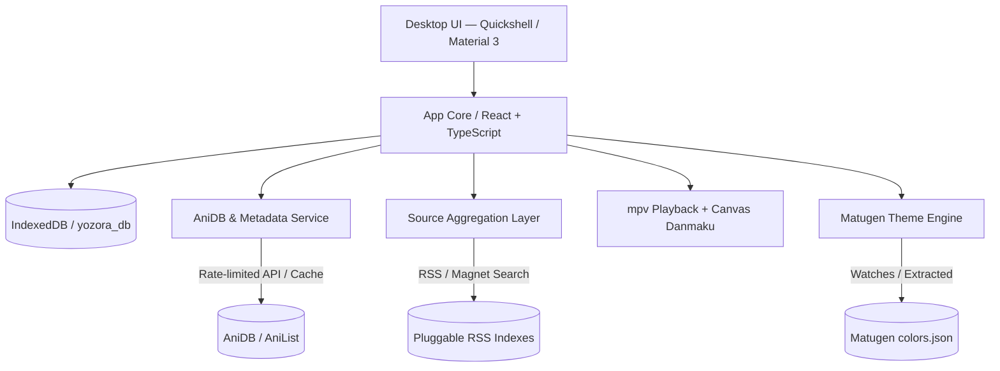

# 🌌 Yozora (夜空)

<p align="center">
  
</p>

<p align="center">
  <b>A native Arch Linux + Hyprland anime tracking, browsing, and playback client.</b><br/>
  Styled to match the <b>end4-pC</b> Quickshell / Material 3 desktop aesthetic with live <b>Matugen</b> theming, <b>AniDB</b> metadata, pluggable <b>BitTorrent/RSS</b> sourcing, and a canvas-based <b>Danmaku</b> playback layer.
</p>

<p align="center">
  
  
  
  
  
</p>

---

## ✨ Features

- 🎨 **Material 3 / end4-pC Quickshell Aesthetic**:
  - Live dynamic palette integration with Matugen (`~/.config/matugen/colors.json`).
  - Wallpaper color extractor generating real-time Material You tokens from desktop backgrounds.
  - Curated presets: *Twilight Sakura*, *Catppuccin Mocha*, *Tokyo Night*, *AniDB Amber*, *Rosé Pine*, *Emerald Aurora*, and *Cyberpunk Neon*.
  - Layer-shell compositor blur, tonal surfaces, and rounded containers (16–28px radii).

- 🧭 **Discover & Airing Timetable (探索)**:
  - 16:9 widescreen **Top Trending** banner showcase (最高热度).
  - Day-by-day weekly **Seasonal Airing Schedule** modal (新番时间表).
  - **Continue Watching** shelf with episode progress bars and quick resume (继续观看).
  - Curated recommendations and season picks (推荐).

- 📚 **AniDB Catalog & Metadata Browser (浏览)**:
  - Multi-criteria filtering by title/romaji/kanji, type (TV, Movie, OVA, ONA, Special), status, seasons, years, genres, and ratings.
  - Rich anime details view with synopsis, Japanese/Romaji titles, tags, relations graph (prequels/sequels), and episode lists.
  - Flood-control rate limiter queue (1500ms backoff) and fuzzy title matching against BitTorrent releases.

- ⚡ **Pluggable BitTorrent & RSS Content Sourcing**:
  - Pluggable RSS feed registry (Nyaa, Mikan Project, Anime Garden, Tokyo Toshokan, SubsPlease, ACG.RIP) with live latency checks.
  - Magnet link parser (`xt=urn:btih:...`) extracting info-hashes, display names, and trackers.
  - Intelligent health ranking algorithm scoring releases by seeders, resolution (1080p, 4K HDR), codecs (HEVC, AV1), and fansub groups.

- 🎬 **mpv Playback Layer & Canvas Danmaku Engine**:
  - High-performance HTML5 Canvas bullet comment engine (rolling, top-fixed, bottom-fixed) with opacity, size, and speed controls.
  - Exact `currentTime` timestamp binding when posting bullet comments, persisted in local storage.
  - mpv OSD HUD with **Stats for Nerds** telemetry (resolution, live bitrate, audio codecs, dropped frames).
  - Precise episode intro skip (`opSkipEnd`) markers and local video file loader (`.mp4`, `.mkv`, `.webm`).

- 📦 **Local-First Library & Cache Manager (追番 & 缓存)**:
  - Watch status categories: *Watching*, *Plan to Watch*, *Completed*, *On Hold*, *Dropped*.
  - 10-point personal rating score editor and AniDB JSON/XML sync import/export.
  - Offline BitTorrent cache manager with throughput meters and offline playback launcher.

---

## 🏗️ Architecture & Tech Stack



---

## 🚀 Installation on Linux

### ⚡ 1. Universal One-Liner (Any Linux Distro)
Auto-detects your distribution, architecture, dependencies, and installs Yozora with desktop launcher & icon integration:

```bash
curl -fsSL https://raw.githubusercontent.com/Luigichopper/Yozora/main/install.sh | bash
```

> [!TIP]
> **Installer Options**:
> - `--user`: Rootless install to `~/.local/bin` *(default, no `sudo` required)*
> - `--system`: System-wide install to `/usr/local/bin`
> - `--appimage`: Download universal AppImage directly
> - `--deb`: Install prebuilt `.deb` package (Debian / Ubuntu / Mint / Pop!_OS)
> - `--arch`: Install prebuilt `.pkg.tar.zst` package (Arch / Manjaro / EndeavourOS)
> - `--uninstall`: Cleanly remove binary, icon, and desktop entry

---

### 📦 2. Distro-Specific Packages

#### 🍙 Arch Linux (AUR & Pacman)
```bash
# Option A: Install from AUR via yay (Source or Prebuilt Binary)
yay -S yozora-git    # Build from source
# OR
yay -S yozora-bin    # Instant prebuilt binary

# Option B: Local PKGBUILD build
cd aur && makepkg -si
```

#### 🍥 Debian / Ubuntu / Linux Mint / Pop!_OS (`.deb`)
Download the latest `yozora_*_amd64.deb` from [Releases](https://github.com/Luigichopper/Yozora/releases/latest) and install:
```bash
sudo apt update
sudo apt install ./yozora_*_amd64.deb
```

#### 📦 Universal AppImage (All Linux Distros)
Download the standalone `yozora-linux-x86_64.AppImage` from [Releases](https://github.com/Luigichopper/Yozora/releases/latest):
```bash
chmod +x yozora-linux-x86_64.AppImage
./yozora-linux-x86_64.AppImage
```

---

### 🛠️ 3. Building from Source & Makefile

```bash
# 1. Clone repository
git clone https://github.com/Luigichopper/Yozora.git
cd Yozora

# 2. Auto-install required build and runtime dependencies
make install-deps

# 3. Development / Hot-Reload Server
make dev

# 4. Build & Install to ~/.local/bin
make build
make install
```


---

## 🐧 Arch Linux & Hyprland Integration

### Hyprland Window Rules (`hyprland.conf`)
Add the following snippet to your `~/.config/hypr/hyprland.conf`:

```ini
# Yozora Desktop Window Rules
windowrulev2 = float, class:^(yozora)$
windowrulev2 = size 1200 800, class:^(yozora)$
windowrulev2 = center, class:^(yozora)$
windowrulev2 = opacity 0.95 0.90, class:^(yozora)$
windowrulev2 = rounding 20, class:^(yozora)$
windowrulev2 = noborder, class:^(yozora)$
windowrulev2 = idleinhibit focus, class:^(yozora)$
```

### Hyprland Lua Configuration (`hyprland.lua`)
For users using Lua-based Hyprland setups (`~/.config/hypr/hyprland.lua`):

```lua
-- Yozora Desktop Window Rules
return {
  windowrulev2 = {
    "float, class:^(yozora)$",
    "size 1200 800, class:^(yozora)$",
    "center, class:^(yozora)$",
    "opacity 0.95 0.90, class:^(yozora)$",
    "rounding 20, class:^(yozora)$",
    "noborder, class:^(yozora)$",
    "idleinhibit focus, class:^(yozora)$",
  }
}
```

### AUR Packaging
Packaging templates are provided in the [`aur/`](file:///c:/Users/Luigi/Documents/Yozora/aur/) directory:
- [`aur/PKGBUILD`](file:///c:/Users/Luigi/Documents/Yozora/aur/PKGBUILD)
- [`aur/yozora.desktop`](file:///c:/Users/Luigi/Documents/Yozora/aur/yozora.desktop)

---

## 📜 Content & Legal Policy
- Metadata is sourced from canonical AniDB / AniList indices under API rate limits.
- Content sourcing is BitTorrent/RSS-shaped and user-configured; Yozora ships with no default unlicensed streaming scrapers.
- `anidb.app` is not affiliated with AniDB and is explicitly out of scope.

---

## 📄 License
This project is licensed under the [GPL-3.0-or-later License](LICENSE).
