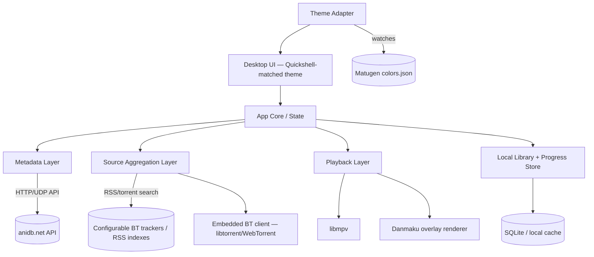

# Project Yozora *(working title)*
### A native Arch/Hyprland anime client — feature & architecture spec

> Style target: **end4-pC** (pctrade's fork of end-4/dots-hyprland) — Material 3 Quickshell desktop aesthetic.
> Functional target: Animeko-style workflow — library, tracking, danmaku, offline caching — rebuilt on a legitimate content-sourcing model.

---

## 1. Overview

Yozora is a desktop anime tracking/playback client for Arch Linux + Hyprland, designed to look and feel like a native extension of an end4-pC desktop rather than a bolted-on Electron app. It borrows Animeko's *workflow* (library sync, episode tracking, danmaku overlay, offline caching, multi-source aggregation) but rebuilds the metadata and content layers on defensible foundations:

- **Metadata**: AniDB's official API (anidb.net) — the real, non-profit anime database, not the unaffiliated streaming site squatting on a similar name.
- **Content sourcing**: BitTorrent/RSS aggregation in the same spirit as Animeko's Mikan/Anime Garden model, rather than scraping a single unlicensed streaming CDN.
- **Shell/runtime**: Evaluated between Holepunch's Pear runtime (P2P-native shipping/updates) and Tauri (lighter, Rust-based, already proven in-house via Ark Studio).

---

## 2. Goals

- [ ] Native-feeling Wayland/Hyprland citizen: layer-shell aware, respects compositor blur/rounding, no Electron chrome bleed
- [ ] Visually indistinguishable from an end4-pC Quickshell module — same corner radii, elevation, type scale, motion curves
- [ ] Dynamic theming: pulls accent color from the user's live Matugen/Material You palette instead of a fixed theme
- [ ] AniDB-backed metadata (series, episodes, relations, tags, staff)
- [ ] Pluggable content-source model (BT trackers/RSS indexes), no hardcoded dependency on a single unlicensed site
- [ ] mpv-based playback core (matches Animeko's own move away from platform-native players)
- [ ] Danmaku overlay, offline caching, watch progress sync
- [ ] AUR-installable (`yay -S yozora` or similar), first-class packaging story

## 3. Non-Goals (explicitly out of scope)

- **anidb.app is not a source.** It is not affiliated with the real AniDB and has no distribution rights to the content it streams — it borrows the name for legitimacy. It will not be integrated as a data or video source. This is a hard architectural boundary, not a "maybe later."
- Not attempting Android/iOS parity in v1 — desktop-first, Arch-first.
- Not shipping a bundled default tracker list that resembles a piracy index; source lists are BYO/config-driven, same posture most legitimate BT clients take.

---

## 4. Design Language — Material 3 via end4-pC

The end4-pC fork of end-4/dots-hyprland already solves the hard part of "what does Material 3 look like on Hyprland" — Yozora should consume that system rather than reinvent it.

| Token | Behavior |
|---|---|
| **Color** | Sourced live from Matugen's generated `colors.json` (or GTK4 `.config/gtk-4.0/colors.css` if Matugen isn't running) — not compiled into the binary. App restyles on wallpaper change, same as the rest of the shell. |
| **Corner radius** | 16–24px on cards, 28px+ on sheets/dialogs, matching Quickshell's rounded-rect containers |
| **Elevation** | Flat + tonal surfaces preferred over drop shadows (Material 3 convention); reserve real shadows for floating/overlay surfaces (danmaku settings sheet, mini-player) |
| **Typography** | Match whatever end4-pC's config declares (commonly Rubik/Inter/Google Sans-style geometric sans) — read from the same font config the shell uses, don't hardcode |
| **Motion** | Emphasized-decelerate / standard easing curves per Material 3 motion spec; avoid Electron's default linear transitions |
| **Blur/translucency** | Defer to Hyprland's compositor blur (`blur_size`, `blur_passes` in `hyprland.conf`) on layer-shell surfaces rather than faking blur in-app — keeps it visually consistent with every other Quickshell panel |

**Practical implication**: theming should be an adapter, not an asset pack. Ship a `ThemeProvider` that:
1. Watches `~/.config/matugen/colors.json` (or wherever the user's pipeline writes it) via `inotify`
2. Falls back to a bundled Material 3 baseline palette if no Matugen output exists
3. Exposes tokens as CSS custom properties (if Electron/web-rendered UI) or a reactive theme object (if native toolkit)

---

## 5. High-Level Architecture

---

## 6. Tech Stack

### Option A — Pear runtime (P2P-native shell)
- **Shell**: Electron + Bare workers via Holepunch's Pear runtime
- **Why**: Native P2P app distribution and OTA updates (`pear run pear://...`), which fits naturally with a BitTorrent-sourced content model — the app itself and its content pipeline share a P2P philosophy
- **Tradeoffs**: Electron footprint on a laptop already juggling Hyprland/Quickshell; Pear's Electron+Bare combo is still comparatively young tooling

### Option B — Tauri (Rust core, web/native-hybrid UI)
- **Why**: Already proven in-house (Ark Studio is Tauri v2), much lighter runtime than Electron, first-class Linux/Wayland support, smaller AUR package size
- **Tradeoffs**: No built-in P2P app-distribution story like Pear — updates would go through a conventional AUR/GitHub-release pipeline instead

**Recommendation**: Prototype the UI shell in Tauri first, since the tooling and packaging muscle memory already exists from Ark Studio — reserve Pear for a later "P2P distribution" milestone if the app-updates-over-P2P angle turns out to matter enough to justify the heavier runtime.

### Core dependencies
| Layer | Library/Tool |
|---|---|
| Playback | `libmpv` (via `mpv.js`/FFI bindings, or Rust `libmpv-rs` under Tauri) |
| BT client | `libtorrent-rasterbar` (Rust: `librqbit`, `rain`) or WebTorrent if staying JS-native |
| Local DB | SQLite (`rusqlite` under Tauri, `better-sqlite3` under Pear/Electron) |
| Theme watch | `notify` (Rust) or `chokidar` (Node) on Matugen's output path |
| Danmaku render | Canvas/WebGL overlay layer, decoupled from mpv's own render surface |

---

## 7. Metadata Layer — anidb.net Integration

AniDB exposes two API surfaces:

- **UDP API** — full-featured, requires client registration (a client name + version registered with AniDB), rate-limited, session-based
- **HTTP API** — simpler, read-mostly, good for anime/episode lookups without a persistent session

**Design**:
- Register a client identifier per AniDB's client registration process before any UDP calls
- Cache aggressively — AniDB's rate limits are strict and built for *occasional* lookups, not a live-scrolling library UI. A local SQLite cache of series/episode metadata, refreshed on a TTL (e.g., weekly) or on explicit "refresh" action, is mandatory, not optional
- Respect AniDB's flood-control conventions (delay between requests, backoff on error codes) — this is the same courtesy Animeko extends to Bangumi
- Map AniDB's ID space locally so the source-aggregation layer can cross-reference release titles/group tags against canonical AniDB entries (fuzzy title matching, since torrent release names are notoriously inconsistent)

---

## 8. Content Sourcing Layer

Modeled on Animeko's actual sourcing architecture — BitTorrent + RSS indexes — rather than any single streaming site:

- **Source plugins**: each source is a small adapter (RSS feed → magnet/torrent resolution → seed/health metadata), user-enabled individually, not bundled as a default "on" list
- **Ranking**: prefer sources by seeder count, resolution/codec match, group reliability (user-configurable weighting, mirrors Animeko's per-source preference system)
- **BT client**: embedded, handles download/seed/cache lifecycle; exposes progress to the UI for the same "cache manager" experience Animeko has
- **No hardcoded scrape targets for unlicensed streaming sites** — this layer stays torrent/RSS-shaped by design, which sidesteps the legal ambiguity of impersonation-branded streaming CDNs entirely

---

## 9. Playback Layer

- **mpv core**, matching Animeko's v6.0.0 shift away from platform players — battle-tested on Linux, minimal overhead, native Wayland output
- Playback info overlay (bitrate/decoder/resolution) as a toggleable panel — direct parity with Animeko's own recent addition
- Scrubbing thumbnail previews generated via periodic frame extraction during buffering/caching
- Custom speed control, intro/outro skip markers (community-sourced timestamps, similar to Animeko/other trackers)
- **Danmaku**: separate render layer composited over the mpv surface, not baked into the video — keeps it toggle-able and independently themeable (Material 3 chip styling for danmaku settings, matching the rest of the shell)

---

## 10. Theming Engine — Matugen / Material You Sync

This is the feature that actually earns the "end4-pC" comparison rather than just borrowing its color palette once:

1. On launch, check for a running Matugen config or its last-written `colors.json`
2. Subscribe to filesystem changes on that path
3. On change, hot-swap the app's color tokens — no restart required, mirrors how the rest of a Quickshell-based desktop reacts to wallpaper changes
4. Fallback chain: Matugen → GTK4 theme colors → bundled Material 3 baseline (so the app still looks correct on a non-Quickshell Hyprland setup)

---

## 11. Feature Matrix (parity target vs Animeko)

| Feature | Animeko | Yozora target |
|---|---|---|
| Library + cloud sync | Bangumi | Local-first, optional AniDB list sync |
| Metadata source | Bangumi | anidb.net |
| Content sourcing | BT + Mikan/Anime Garden | BT + user-configured RSS indexes |
| Player core | mpv (as of v6.0.0) | mpv (from v1) |
| Danmaku | Yes, cloud-filtered | Yes, local + optional community source |
| Offline caching | Yes | Yes |
| Watch-together (syncplay) | Yes (v6.0.0) | Post-v1 stretch goal |
| Windows ARM64 | Yes | N/A — Linux/Arch only |
| Native theming to DE | No | **Yes — Matugen/Material You sync (Yozora-exclusive)** |
| AUR packaging | Yes (`animeko-appimage`) | Yes, native package target |

---

## 12. Packaging & Distribution (Arch)

- **Primary target**: AUR package building a native binary (Tauri) rather than an AppImage wrapper, if the Tauri path is chosen — smaller footprint, tighter Hyprland integration (proper `.desktop` file, icon theme respect, portal-based file dialogs)
- `.desktop` entry with correct `StartupWMClass` for Hyprland window rules (so users can pin a `windowrulev2` for floating/tiled behavior, picture-in-picture-style mini player, etc.)
- Respect `xdg-desktop-portal-hyprland` for screenshot/screen-share features (video capture, thumbnail generation) rather than X11-era assumptions
- Delta/incremental updates: either via a conventional AUR bump, or — if Pear is adopted later — via Pear's native P2P OTA update path

---

## 13. Roadmap / Milestones

1. **M0 — Shell prototype**: Tauri window, Matugen theme adapter, static mock library grid styled to end4-pC spec
2. **M1 — Metadata**: AniDB client registration, HTTP API integration, local SQLite cache, search + detail pages
3. **M2 — Sourcing**: pluggable RSS/BT source adapters, source health ranking, cache manager UI
4. **M3 — Playback**: mpv embed, danmaku overlay layer, scrubbing previews
5. **M4 — Polish**: intro/outro skip, playback info panel, custom speed control
6. **M5 — Packaging**: AUR submission, `.desktop`/portal integration, Hyprland window-rule documentation
7. **Stretch**: watch-together sync, Pear-based P2P distribution

---

## 14. Content & Legal Considerations

- Metadata usage stays within AniDB's API terms (client registration, rate limits, attribution where required)
- Content sourcing stays torrent/RSS-shaped and user-configured — the app ships no default index resembling an unlicensed streaming aggregator
- No use of the anidb.app name, branding, or endpoints anywhere in the project — avoids both the legal ambiguity of that site and any user confusion between it and the real AniDB

---

## 15. Open Questions

- [ ] Tauri vs Pear — decide before M0, since it determines the entire shell layer
- [ ] Ship a bundled BT client, or shell out to an existing local client (transmission-daemon, etc.) via RPC? Bundled is more Animeko-like; shelling out is lighter and more "Unix way"
- [ ] AniDB list sync — full read/write integration, or read-only metadata with local-only progress tracking for v1?
- [ ] Final project name (Yozora is a placeholder)
